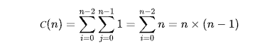
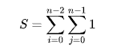
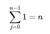
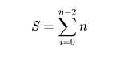
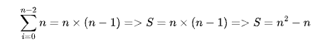
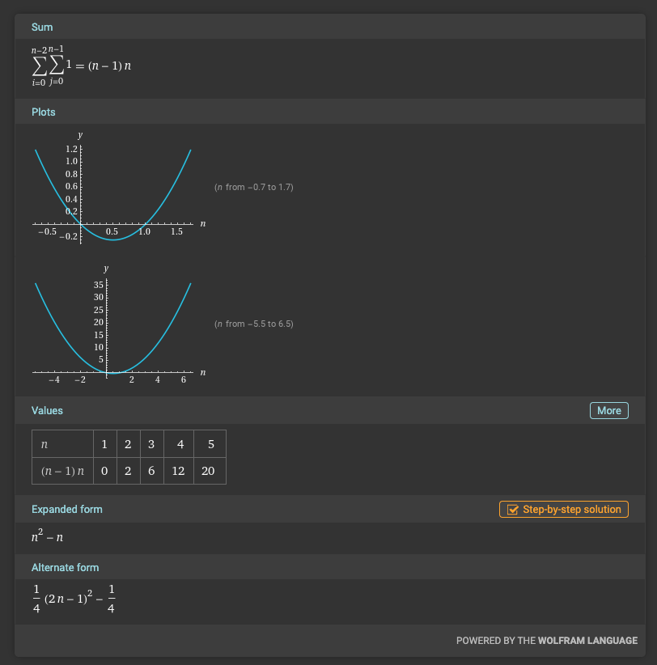
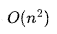

# Анализ сложности алгоритма

1. **Размерность входных данных**
   Функция принимает в качестве аргумента двухмерный слайс целых чисел — `a[][]int => len(a[][]int) - по высоте матрицы и len(a[]int) по ширине матрицы`.

2. **Определение основной операции алгоритма**
   Основная операция алгоритма — это сравнение элементов: `a[i][j] != a[j][i]`.

3. **Проверка зависимости числа выполняемых основных операций от размера входных данных**
   Да, число основных операций зависит только от размера входных данных. Эта операция проверяет, равны ли два элемента матрицы (`a[i][j]` и `a[j][i]`), и результат зависит только от значений этих элементов.

4. **Запись суммы, выражающей количество выполняемых основных операций алгоритма**

где:
- (n) — размерность матрицы `a`
- (С) — количество основных операций.

5. **Упрощение формулы количества основных операций алгоритма**
    - Внутренний цикл по (j) выполняется (n) раз для каждого значения (i).
    - Внешний цикл по (i) выполняется (n-1) раз.

Теперь запишем общую формулу для количества основных операций:

- Внутренняя сумма:

Подставим результат во внешнюю сумму:

- Внешняя сумма:

где (n) — размерность матрицы `a`.

В итоге получаем сложность

.