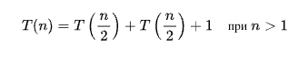
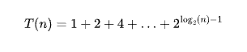
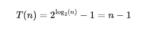
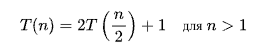

1. Размер входных данных алгоритма `len(a)`
2. Определите основную операцию алгоритма: сравнение `if t1 <= t2`
3. Проверьте, зависит ли число выполняемых основных операций только от размера входных данных: `Да, (M(n)) - кол-во основных операций длиной len(a)`
4. Составьте рекуррентное уравнение, выражающее количество выполняемых основных операций алгоритма, и укажите соответствующие начальные условия

Алгоритм делит массив пополам



5. Найдите решение рекуррентного уравнения или, если это невозможно, определите хотя бы его порядок роста

Рассмотрим дерево рекурсии:
```
- Уровень 0: 1 вызов, 1 операция
- Уровень 1: 2 вызова, 2 операции
- Уровень 2: 4 вызова, 4 операции
...

На уровне k у нас 2^k вызовов и 2^k операций.
Уровней всего - log2(n)

....
```



`=>`



`=>`



### Итоговая сложность:

Таким образом, сложность данной функции `MinEl2` составляет `O(n)`.

Если сравнивать с предыдущим, то:
- Глубина рекурсии у второго `MinEl2` составляет `log(n)`, а у предыдущего составляет `n`
- Эффективней первый
- Бенчмарки в main_test.go
- parallelMin также O(n)